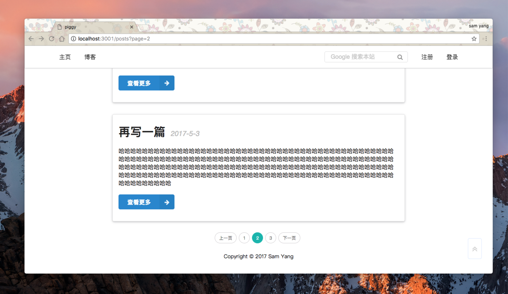

# piggy

a simple blog framework, powered by Express.js

## Environment

NodeJS: 7.4.0

MySQL: 5.7.17

Sequelize 3.x

Express 4.x

## TODO
- [x] tag
- [x] pagination
- [x] security
- [x] backup
- [x] search

## How to use

* 本项目clone到本地并进入项目本地目录
* `$ npm install`
* `$ node index.js`

你可以将此博客部署到云服务中。
